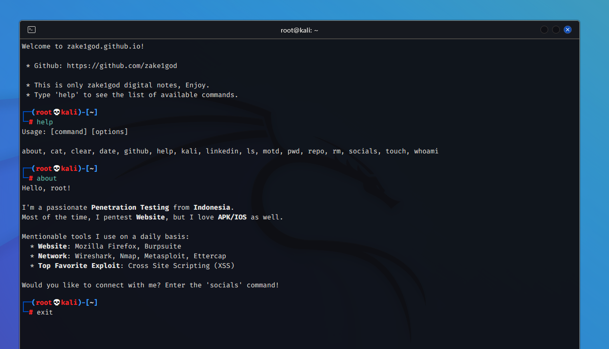

<h1><a href="https://zake1god.github.io/" target="_blank">zake1god - Terminal Website</a></h1>

This is a Kali Linux Terminal-like personal website.



<hr>

## Features

- Kali Linux-like interface
- Fun commands
- Tab autocomplete
- Hotkeys
- Responsiveness
- Interactive UI

## Building from source

```sh
# 1. Clone the repo
git clone https://github.com/zake1god/zake1god.github.io.git
cd zake1god.github.io

# 2. Install the necessary dependencies
npm i

# 3. Run the app
npm start
```

## Coming Soon
- XSS Payload 2023
- Dork list 2023
- Another payload 2023

## Credit 
- This theme original by <a href="https://0l1v3rr.github.io/" target="_blank">0l1v3rr</a>